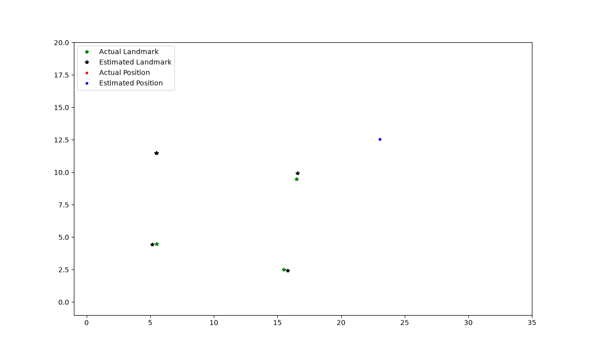
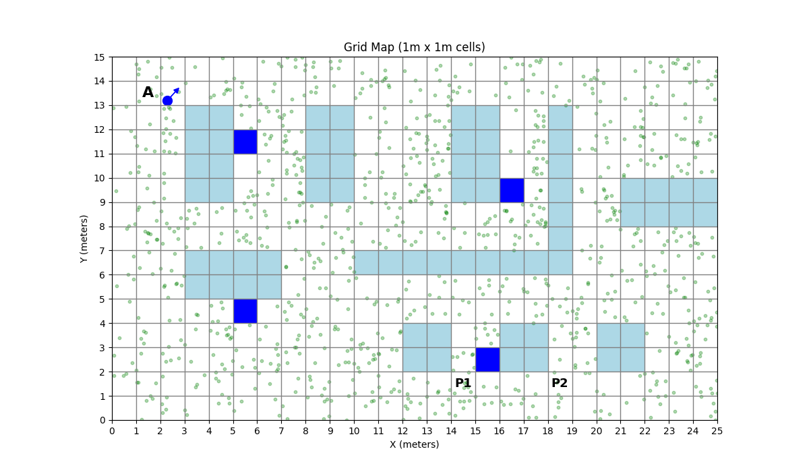
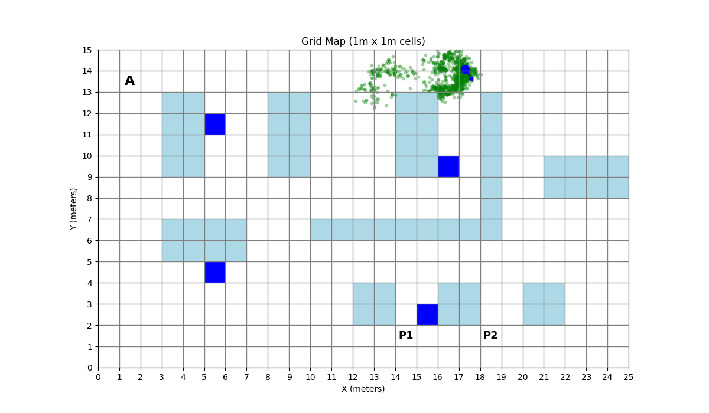
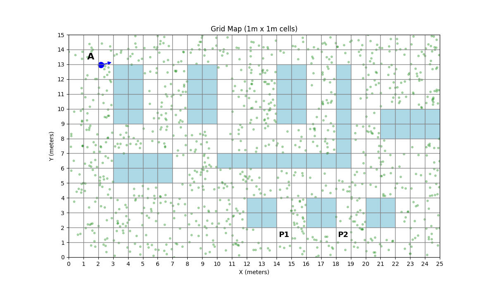
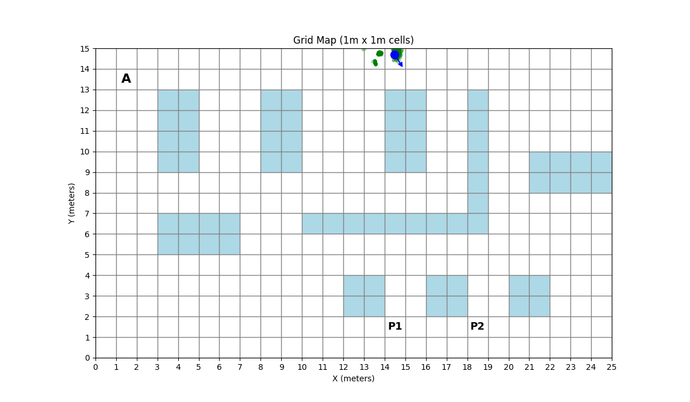
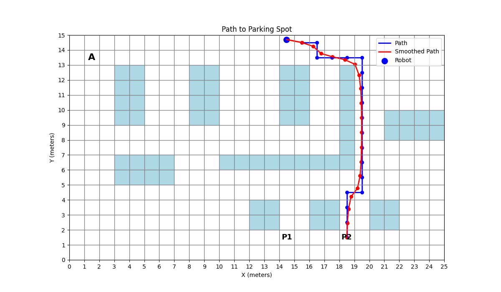
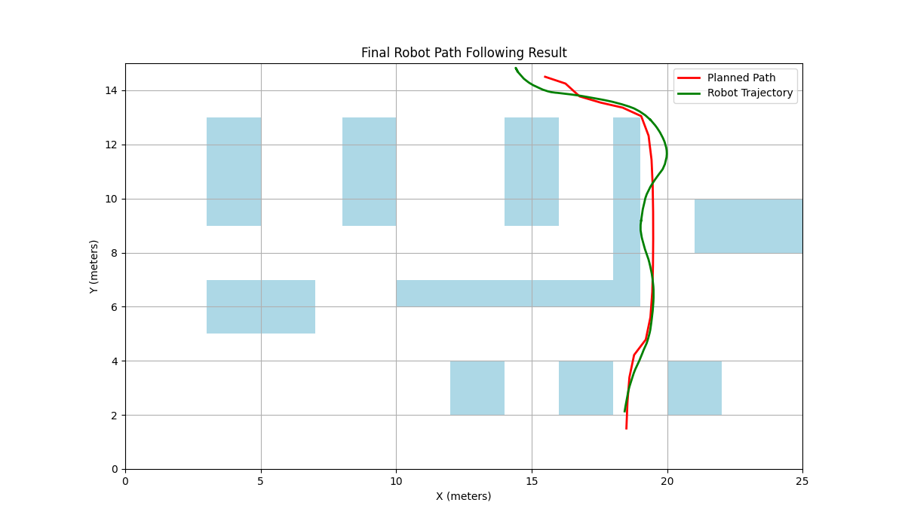

# 🚗 Mobile Robot Autonomous Navigation System
> SLAM, Localization, Path Planning, Navigation 알고리즘을 통합적으로 구현한 모바일 로봇 자율주행 시뮬레이션 프로젝트입니다.

## 📌 프로젝트 소개
이 프로젝트는 Python을 기반으로 모바일 로봇(Bicycle Model)이 미지의 환경에서 지도를 생성하고(SLAM), 파티클 필터를 이용해 자신의 위치를 추정하며(Localization), 목적지까지의 최적 경로를 탐색(Planning)한 뒤, 해당 경로를 따라 목표 지점까지 주행(Navigation)하는 일련의 자율주행 시스템을 구현했습니다.

## ⚙️ 주요 기능 및 적용 알고리즘

### 1. SLAM (Simultaneous Localization and Mapping)
* **환경 및 모델:** 15x25 (1m x 1m) 크기의 Grid Map / 자전거 모델 (Bicycle Model)
* **구현 내용:** 랜드마크를 기반으로 로봇의 위치와 지도를 동시에 추정합니다.
* **성능 분석:** 센서 노이즈와 액션 노이즈(정규 분포)를 각각 0.0001부터 0.6까지 다르게 설정하며, 노이즈 비율이 SLAM 성능에 미치는 영향을 비교 및 분석하였습니다.

### 2. Localization (위치 추정)
* **알고리즘:** 파티클 필터 (Particle Filter)
* **구현 내용 1 (단일 센싱):** 최대 센싱 거리 5m, 센싱 노이즈 분산 0.4m 조건에서 로컬라이제이션을 수행합니다. 주변 랜드마크의 밀집도(많을 때 vs 없을 때)에 따른 파티클의 수렴 과정을 시뮬레이션했습니다.
* **구현 내용 2 (360도 전방향 센싱):** 10도 단위로 360도 전 방향을 센싱(최대 거리 8m, 분산 0.2m)하여 위치를 추정합니다. 센서가 비현실적으로 정확할 때(노이즈 0.0001) 파티클이 엉뚱한 곳에 수렴하는 현상을 발견하고, 센싱 범위 확장을 통해 이를 개선하는 과정을 실험했습니다.

### 3. Path Planning (경로 계획)
* **알고리즘:** A* Algorithm & Smoothing Algorithm
* **구현 내용:** 로봇이 확신한 현재 위치에서부터 목적지 주차 구역(P1, P2)까지의 최단 경로를 A* 알고리즘으로 먼저 구합니다. 이후 **스무딩(Smoothing) 알고리즘**을 적용하여 격자 형태의 경로를 실제 로봇이 주행하기 적합한 곡선의 현실적인 최적 경로로 변환합니다.

### 4. Navigation & Control (주행 및 제어)
* **알고리즘:** PID 제어 (PID Control)
* **구현 내용:** 플래닝 단계에서 생성된 스무딩 경로를 따라 로봇이 이탈 없이 이동하여 목표 지점(P2)에 성공적으로 주차할 수 있도록 PID 제어기를 구현 및 적용하였습니다.

## 📊 시뮬레이션 결과

*(여기에 각 항목에 맞는 시뮬레이션 결과 이미지들을 추가해주세요)*

* **SLAM 궤적 및 맵핑 결과 (모션 노이즈: 0.2, 센서 노이즈: 0.25)**
  * 
* **파티클 필터를 이용한 위치 수렴 과정 (Landmark vs LiDAR)**
  <table>
    <tr align="center">
      <th>센싱 방식</th>
      <th>초기 상태 (Initial)</th>
      <th>수렴 완료 (Converged)</th>
    </tr>
    <tr align="center">
      <td><b>Landmark 기반</b></td>
      <td> 파티클 분산</td>
      <td> 위치 추정 완료</td>
    </tr>
    <tr align="center">
      <td><b>LiDAR (벽 감지) 기반</b></td>
      <td> 파티클 분산</td>
      <td> 위치 추정 완료</td>
    </tr>
  </table>
* **A * 경로 탐색 및 Smoothing 결과**
  * 
* **PID 제어를 통한 최종 주차 완료 궤적**
  * 

## 💡 결론 및 회고
여러 알고리즘들을 하나의 모바일 로봇 시스템으로 결합하여 매핑부터 로컬라이제이션, 플래닝, 내비게이션까지 자율주행의 전체 파이프라인을 성공적으로 구현했습니다. 
특히 센싱 노이즈와 범위 등 다양한 파라미터를 조작하며 예상치 못한 결과(센서가 너무 정확할 때의 파티클 분산 등)를 마주하고, 이를 해결하기 위해 디버깅하는 과정에서 실제 하드웨어 및 소프트웨어 통합 시스템에서 노이즈 제어의 중요성을 깊이 배울 수 있었습니다.

## 🛠 Tech Stack
* **Language:** Python
* **Key Libraries:** `numpy`, `matplotlib` 등 (사용한 주요 라이브러리 작성)
